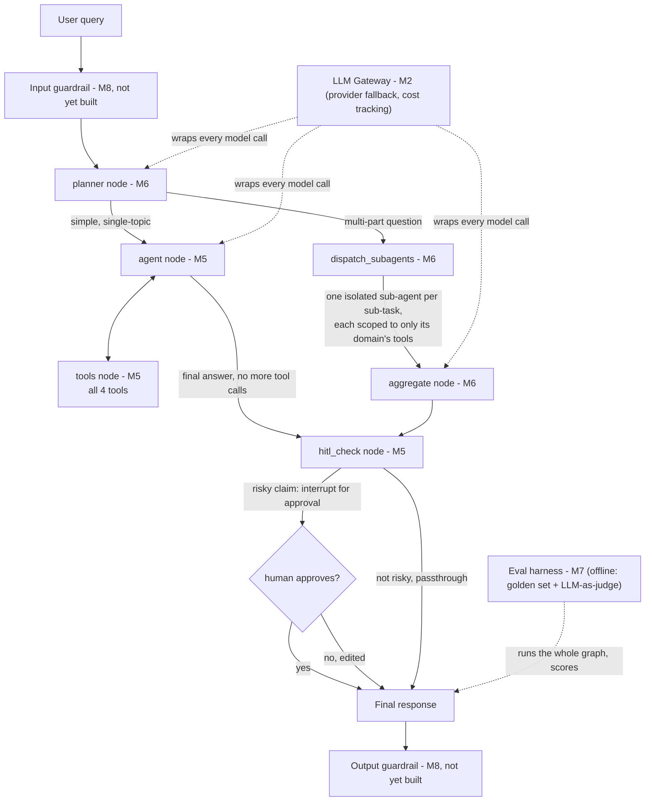

# Architecture (M1)

## System diagram: LangGraph shape, and where gateway/eval/guardrails sit

**As actually built (M5/M6), not the original guess:**



**How to read this:**
- **`planner` (M6)** is the real entry point, not a router that sits beside the loop - it decides up front whether the question is simple (one topic) or needs decomposition.
- **Simple path**: `agent` \<-\> `tools` is exactly the M5 ReAct loop - the LLM picks a tool, sees the result, decides whether to call another or answer. This already handles *some* multi-tool questions on its own (parallel tool calls in one turn), which is why the planner only delegates when a question has genuinely distinct parts.
- **Delegation path**: each sub-task in the plan gets its own `create_agent()` instance with a **fresh, isolated message history** and only the tools relevant to its domain (docs / changelog / issues) - it never sees the other sub-agents' work. `aggregate` is the one node that reads all sub-agent outputs together and writes the combined answer.
- **`hitl_check` (M5)** is shared by both paths - one interrupt point regardless of which route produced the draft answer.
- **Gateway (M2)** coverage gap, found while building M6: `dispatch_subagents` calls `create_agent(model=llm, ...)`, which invokes the LLM directly inside LangGraph's prebuilt loop - **not** through our `gateway_invoke()` wrapper. So sub-agent LLM calls still get fallback + rate-limiting (those are baked into the `ChatGroq`/`ChatGoogleGenerativeAI` objects themselves), but they bypass our cost/usage logging in `data/usage_log.jsonl`. Not yet fixed - worth revisiting before M9 production monitoring, since usage numbers would currently undercount real spend once delegation is used.
- **Guardrails (M8)** and **Eval (M7)** are unbuilt - shown here as their intended position, not implemented yet.

## Repo layout

```
fastapi-support-agent/
├── src/fastapi_support_agent/
│   ├── ingestion/     # pulls raw docs/changelog → data/raw/ (M1, this milestone)
│   ├── rag/           # chunking, embeddings, hybrid search (M3)
│   ├── gateway/        # provider fallback, cost tracking (M2)
│   ├── tools/           # changelog lookup, deprecation check, issue search (M4)
│   ├── agents/           # LangGraph graph, HITL, sub-agents (M5/M6)
│   ├── eval/              # golden set + judge (M7)
│   └── guardrails/         # M8
├── data/                    # gitignored, entirely regenerable via scripts/
├── scripts/                  # one-off ingestion/build CLI entrypoints
├── tests/
└── docker/                    # M9
```

## Data sources

| Source | What it's for | Acquisition | Freshness model |
|---|---|---|---|
| FastAPI docs (`docs/en/docs/**/*.md`) | RAG corpus for doc Q&A | Shallow + sparse `git clone` of `fastapi/fastapi@master`, `scripts/fetch_docs.py`, safe to re-run (`git pull` if already cloned) | Static snapshot, refreshed on demand |
| Changelog (`docs/en/docs/release-notes.md`) | Version lookup / "is X deprecated" tool (M4) | Comes free from the same sparse clone above — it lives inside `docs/en/docs/`, no separate fetch | Static snapshot, refreshed on demand |
| GitHub issues (`fastapi/fastapi` issue tracker) | Issue search tool (M4) — "has this been reported," known bugs, workarounds | Live query against the GitHub REST/Search API at ask-time, authenticated with a fine-grained PAT scoped to public-repo read-only (`GITHUB_TOKEN` in `.env`, see `.env.example`) | Always live — never bulk-downloaded, since freshness (open/closed state, new comments) matters more than a frozen copy |

Why issues aren't bulk-fetched like the docs: there are tens of thousands of them, and what makes them useful for support is current state, not a stale snapshot. Docs and the changelog are effectively immutable at a point in time, so a snapshot is fine there.

## Retrieval pipeline (M3)

- **Chunking** (`rag/chunking.py`) — two-stage split: `MarkdownHeaderTextSplitter` first (so every chunk knows its section), then `RecursiveCharacterTextSplitter` within each section (so chunk sizes are consistent, ~800 chars). Internal-only files (leading underscore, e.g. `_llm-test.md`) and `release-notes.md` are excluded — the changelog gets its own structured parser in M4. Each chunk carries `source_file`, `section`, and a `url` mapped back to the live `fastapi.tiangolo.com` site (not the GitHub repo). 1,595 chunks from the current corpus.
- **Embeddings** — local, via `langchain-huggingface`'s `HuggingFaceEmbeddings` running `sentence-transformers/all-MiniLM-L6-v2`. Chosen over an API-based embedding provider (e.g. Gemini's) specifically because indexing thousands of chunks would burn through a free-tier request quota fast — local embedding is unlimited and genuinely free forever.
- **Vector store** (`scripts/build_index.py`) — **Chroma**, persisted to `data/vector_store/chroma/` (gitignored, rebuilt from raw docs on demand). Chosen over FAISS (used previously in `RAG-Tutorials`) because every chunk's metadata travels with its embedding, which hybrid search and citations both depend on.
- **Hybrid search** (`rag/retrieval.py`, `build_hybrid_retriever`) — Chroma vector search + `BM25Retriever` (keyword matching, good at exact terms like class names) merged via `EnsembleRetriever`, which uses Reciprocal Rank Fusion. Returns the union of both retrievers' results, not trimmed to a fixed count.
- **Reranking** (`rag/retrieval.py`, `build_reranked_retriever`) — the merged hybrid candidates get rescored by a cross-encoder (`cross-encoder/ms-marco-MiniLM-L-6-v2`, local, via `HuggingFaceCrossEncoder` + `CrossEncoderReranker`), then trimmed to a final `top_n`. Added after testing showed the raw hybrid merge included some weak keyword-only matches that a query+document-aware model correctly demotes.
- **Not yet built**: the synthesis step that takes reranked chunks + the user's question and calls `gateway_invoke()` to produce an actual cited answer. Retrieval returns chunks today, not answers.

Package note: in LangChain's v1 reorg, `EnsembleRetriever`, `ContextualCompressionRetriever`, and `CrossEncoderReranker` all moved out of the main `langchain` package into a separate `langchain-classic` package — found by testing imports directly rather than trusting older docs/tutorials.

## Dependency management

`uv`-managed project, Python 3.13. Every dependency added via `uv add` so versions are resolved live against PyPI and locked in `uv.lock` — no hand-typed version guesses. Current core deps: `langchain==1.3.13`, `langgraph==1.2.9`, `langsmith==0.10.3`, `chromadb==1.5.9`, `langchain-chroma==1.1.0`, `langchain-groq`, `langchain-google-genai`, `langchain-huggingface`, `sentence-transformers`, `langchain-community`, `rank-bm25`.

## Open decisions

- **Automated tests**: everything so far has been verified with manual smoke-test scripts (`scripts/test_gateway.py`, ad-hoc checks), not a `pytest` suite, even though `tests/` exists in the repo layout. M7's eval harness will be the main quality gate for RAG/agent behavior — not yet decided whether a lightweight `pytest` suite runs alongside it for the non-LLM plumbing (chunking, URL mapping, gateway fallback logic).
