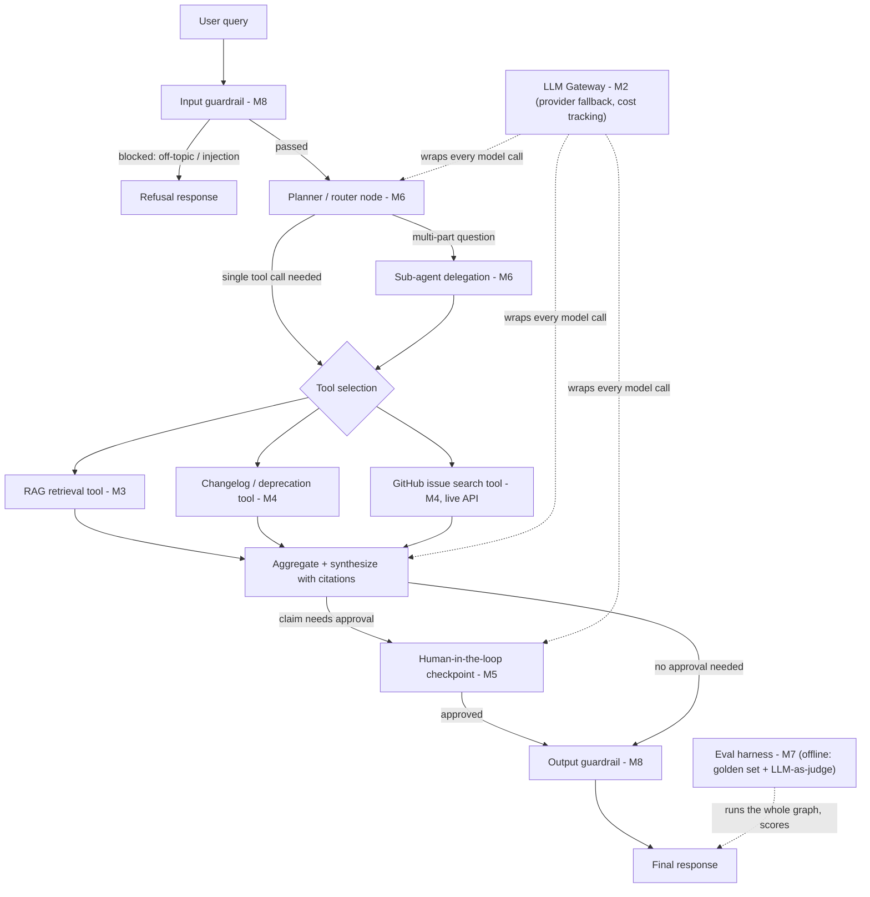

# Architecture (M1)

## System diagram: LangGraph shape, and where gateway/eval/guardrails sit



**How to read this:**
- The graph itself (nodes/edges) is built in **M5** (basic router + tool-calling) and extended in **M6** (the sub-agent delegation branch, for questions that need more than one tool).
- The **gateway (M2)** isn't a node in the graph — it's a wrapper every node's LLM call goes through, which is exactly why we're building it *before* the graph exists: nothing needs retrofitting.
- **Guardrails (M8)** sit at the two edges of the graph — input (before the planner ever sees the query) and output (before the response leaves) — not scattered through the middle.
- **HITL (M5)** is one specific interrupt point: before the agent finalizes an answer that asserts something risky (a deprecation/breaking-change claim, or before it spends GitHub API quota on an ambiguous issue search). Not every response pauses for approval — just the ones matching that condition.
- **Eval (M7)** never runs inside this live request graph — it's a separate offline harness that replays the golden Q&A set through the same graph and scores the output afterward.

## Repo layout

```
fastapi-support-agent/
├── src/fastapi_support_agent/
│   ├── ingestion/     # pulls raw docs/changelog → data/raw/ (M1, this milestone)
│   ├── rag/           # chunking, embeddings, hybrid search (M3)
│   ├── gateway/        # provider fallback, cost tracking (M2)
│   ├── tools/           # changelog lookup, deprecation check, issue search (M4)
│   ├── agents/           # LangGraph graph, HITL, sub-agents (M5/M6)
│   ├── eval/              # golden set + judge (M7)
│   └── guardrails/         # M8
├── data/                    # gitignored, entirely regenerable via scripts/
├── scripts/                  # one-off ingestion/build CLI entrypoints
├── tests/
└── docker/                    # M9
```

## Data sources

| Source | What it's for | Acquisition | Freshness model |
|---|---|---|---|
| FastAPI docs (`docs/en/docs/**/*.md`) | RAG corpus for doc Q&A | Shallow + sparse `git clone` of `fastapi/fastapi@master`, `scripts/fetch_docs.py`, safe to re-run (`git pull` if already cloned) | Static snapshot, refreshed on demand |
| Changelog (`docs/en/docs/release-notes.md`) | Version lookup / "is X deprecated" tool (M4) | Comes free from the same sparse clone above — it lives inside `docs/en/docs/`, no separate fetch | Static snapshot, refreshed on demand |
| GitHub issues (`fastapi/fastapi` issue tracker) | Issue search tool (M4) — "has this been reported," known bugs, workarounds | Live query against the GitHub REST/Search API at ask-time, authenticated with a fine-grained PAT scoped to public-repo read-only (`GITHUB_TOKEN` in `.env`, see `.env.example`) | Always live — never bulk-downloaded, since freshness (open/closed state, new comments) matters more than a frozen copy |

Why issues aren't bulk-fetched like the docs: there are tens of thousands of them, and what makes them useful for support is current state, not a stale snapshot. Docs and the changelog are effectively immutable at a point in time, so a snapshot is fine there.

## Vector store

**Chroma** — embedded, persists to disk automatically, and every chunk carries metadata (source file, URL, section) alongside its embedding, which hybrid search and citations both depend on. Chosen over FAISS (used previously in `RAG-Tutorials`) specifically for that built-in metadata/persistence story.

## Dependency management

`uv`-managed project, Python 3.13. Every dependency added via `uv add` so versions are resolved live against PyPI and locked in `uv.lock` — no hand-typed version guesses. Current core deps: `langchain==1.3.13`, `langgraph==1.2.9`, `langsmith==0.10.3`, `chromadb==1.5.9`, `langchain-chroma==1.1.0`.
